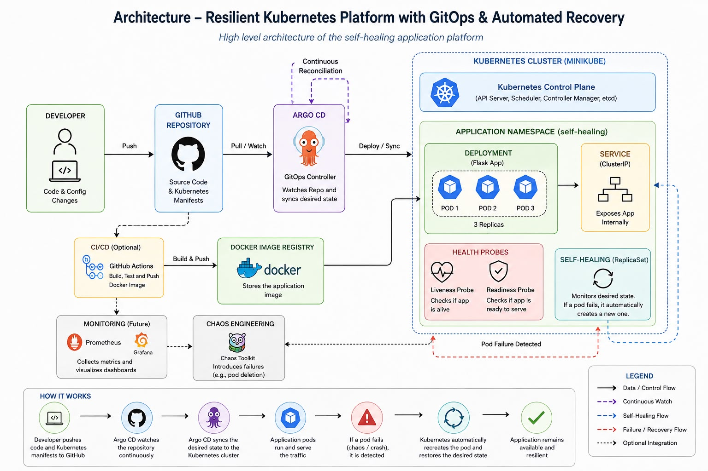
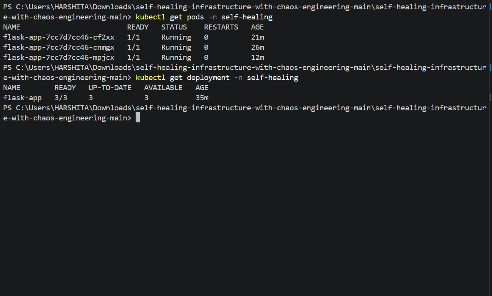
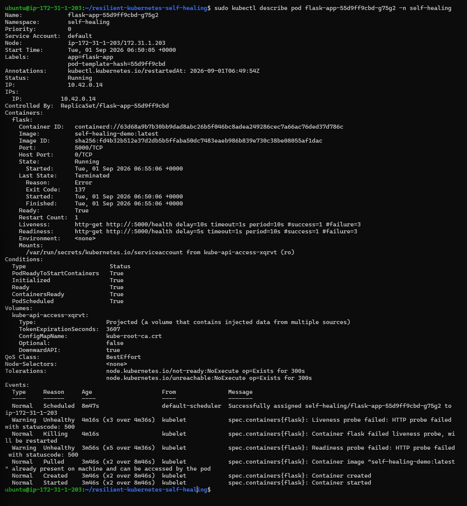
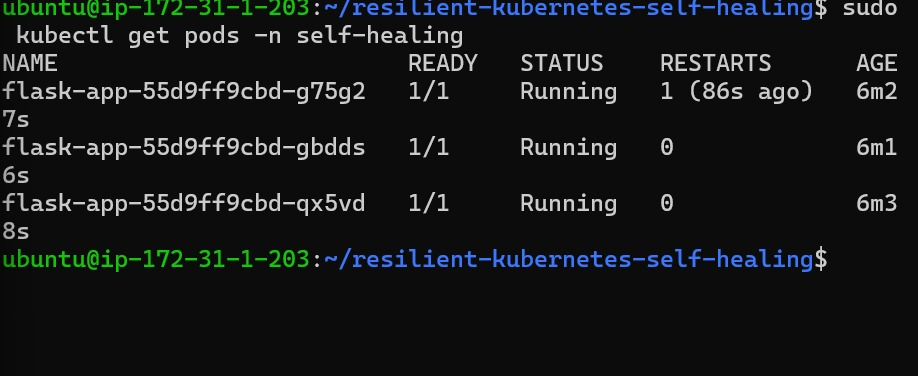
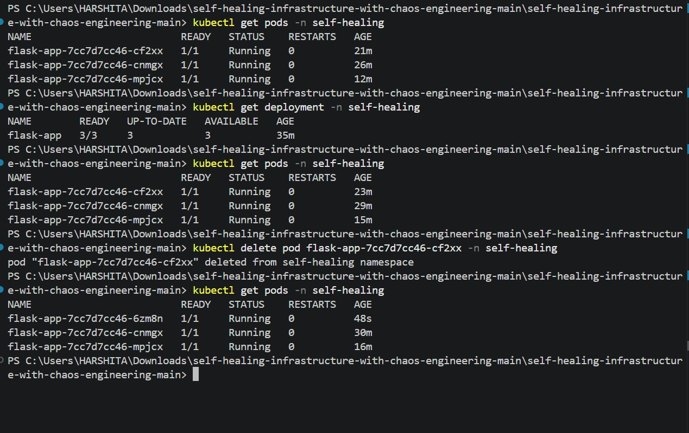
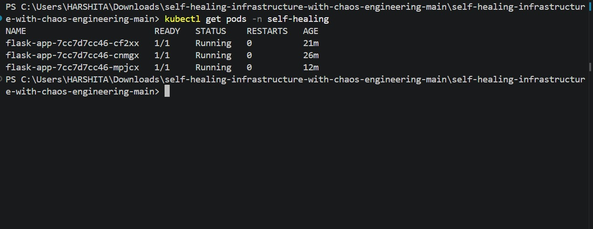
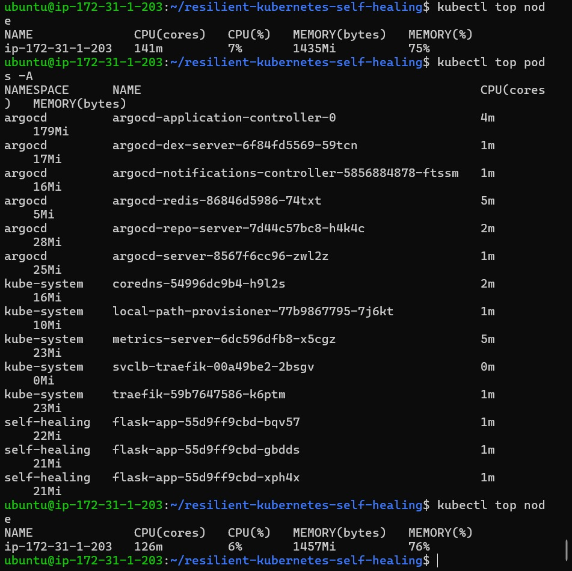
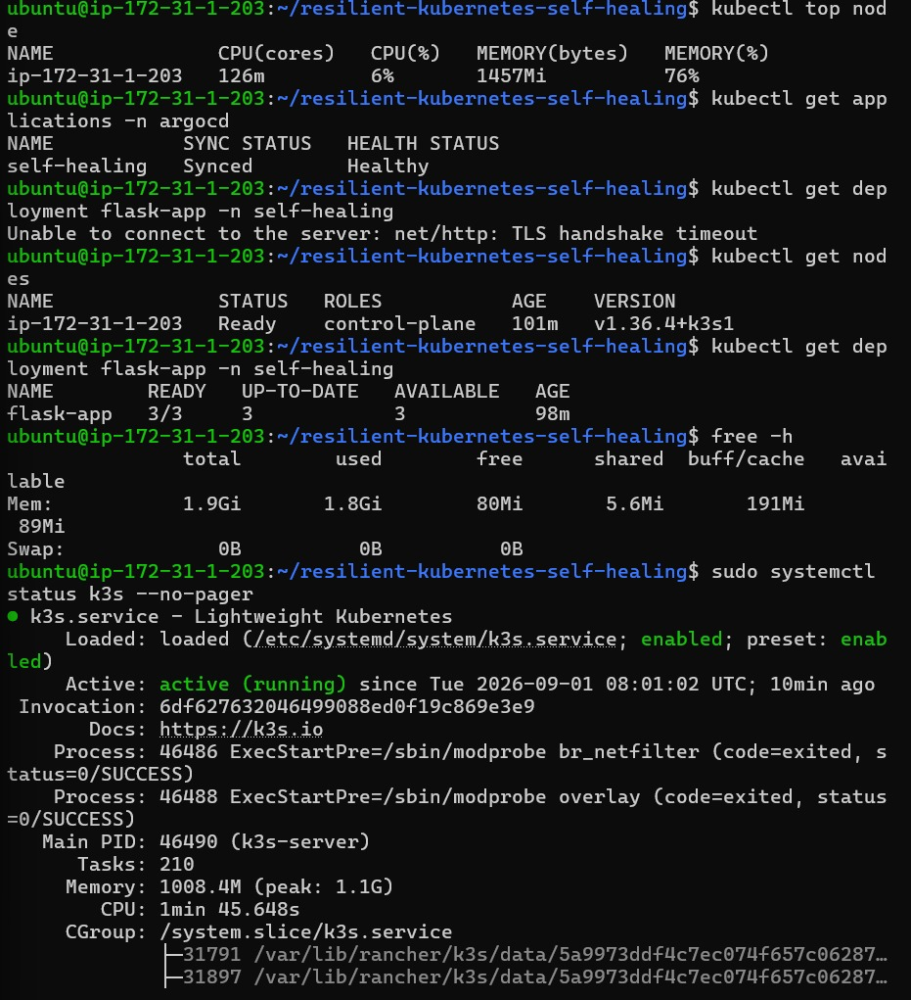
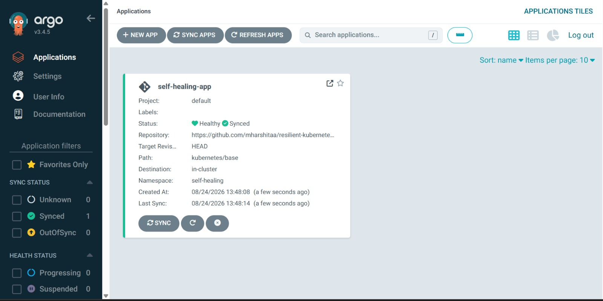
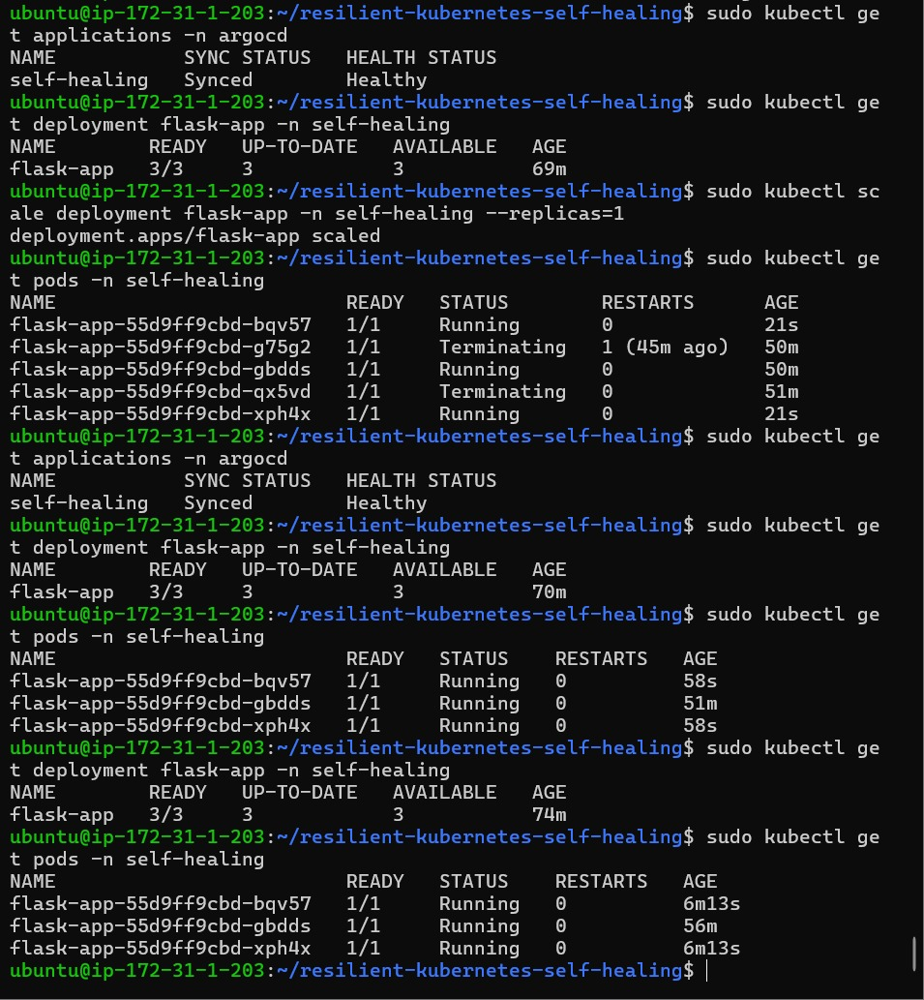

# Design of Self-Healing Kubernetes Application Using GitOps-Based Automated Recovery

A DevOps project demonstrating **Kubernetes deployment, fault recovery, chaos engineering, monitoring, and self-healing** using Docker, K3s, AWS EC2, and Argo CD.

## 📌 Overview

A Flask application is containerized using Docker and deployed on a **K3s Kubernetes cluster running on AWS EC2** with **3 replicas**.

Pod and container failures are intentionally simulated. Kubernetes automatically detects failures, restarts failed containers, creates replacement pods, and maintains the desired application state.

## 🏗️ Architecture



## 🛠️ Tech Stack

* **Docker** – Containerization
* **K3s Kubernetes** – Container orchestration & self-healing
* **AWS EC2** – Cloud infrastructure
* **Flask** – Application
* **kubectl** – Cluster management
* **Argo CD** – GitOps deployment
* **GitHub** – Source control
* **Liveness & Readiness Probes** – Application health checks
* **Metrics Server** – Resource monitoring
* **Chaos Engineering** – Failure simulation

## 📂 Project Structure

```text
resilient-kubernetes-self-healing/

├── app/
├── argocd/
├── docker/
├── infra/
├── kubernetes/
├── App-healthy.png
├── Architecture-diagram.jpeg
├── Argo CD GitOps Self-Healing.png
├── argo-cd.png
├── Chaos-pod-delete.png
├── Deployment.png
├── Kubernetes Resource Monitoring using Metrics Server1.png
├── Kubernetes-Monitoring-and-Health-Check.png
├── Liveness-probe-restart.png
├── Liveness-self-healing.png
├── Pods-running.png
└── README.md
````

## 🚀 Deployment

The Flask application is deployed on the K3s cluster running on AWS EC2.

```bash
kubectl get nodes
kubectl get deployment -n self-healing
```

The deployment maintains **3/3 available replicas**.



## ❤️ Application Health

The Flask application's health endpoint is monitored using Kubernetes health probes.

## 🔍 Liveness & Readiness Probes

Liveness and readiness probes monitor application health and availability.

If a container fails the liveness probe, Kubernetes automatically restarts it.





## 💥 Chaos Engineering

A running pod was intentionally deleted to simulate a failure:

```bash
kubectl delete pod <pod-name> -n self-healing
```

Kubernetes automatically created a replacement pod.



## 🔄 Self-Healing

```text
3 Running Pods
      ↓
Pod Failure
      ↓
Kubernetes Detects Failure
      ↓
Replacement Pod Created
      ↓
3 Running Pods
```



## 📊 Resource Monitoring

Kubernetes Metrics Server was configured for CPU and memory monitoring.

```bash
kubectl top node
kubectl top pods -A
```





## 🔁 GitOps with Argo CD

Argo CD continuously monitors the GitHub repository and synchronizes the desired Kubernetes state.

```text
GitHub → Argo CD → K3s Kubernetes → Flask Application
```





## 📊 Results

* ✅ Flask application deployed successfully
* ✅ 3 Kubernetes replicas running
* ✅ Pod failure successfully simulated
* ✅ Failed pod automatically replaced
* ✅ Failed container automatically restarted
* ✅ Liveness and readiness probes configured
* ✅ Application remained healthy after recovery
* ✅ Argo CD GitOps deployment configured
* ✅ Argo CD application synchronized and healthy
* ✅ Kubernetes Metrics Server configured
* ✅ CPU and memory usage monitored

## 🔮 Future Enhancements

* Prometheus & Grafana monitoring
* GitHub Actions CI/CD
* Terraform Infrastructure as Code
* Automated alerts
* AWS EKS deployment

## 👩‍💻 Author

**Harshita Manchanda**

