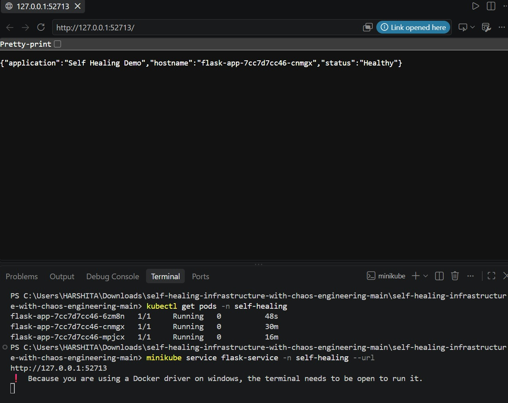

# Resilient Kubernetes Infrastructure with Self-Healing

A DevOps project demonstrating **Kubernetes deployment, fault recovery, chaos engineering, and self-healing** using Docker, Kubernetes, Minikube, and Argo CD.

## 📌 Overview

A Flask application is containerized using Docker and deployed on Kubernetes with **3 replicas**.

A pod failure is intentionally simulated using chaos engineering. Kubernetes automatically detects the failure, creates a replacement pod, and maintains the desired application state.

## 🏗️ Architecture


## 🛠️ Tech Stack

* **Docker** – Containerization
* **Kubernetes** – Container orchestration & self-healing
* **Minikube** – Local Kubernetes cluster
* **Flask** – Application
* **kubectl** – Cluster management
* **Argo CD** – GitOps deployment
* **GitHub** – Source control

## 📂 Project Structure

```text
self-healing-infrastructure/
├── app/
│   ├── app.py
│   └── requirements.txt
├── argocd/
│   └── application.yaml
├── docker/
│   └── Dockerfile
├── infra/
│   └── kind-config.yaml
├── kubernetes/
│   └── base/
│       ├── deployment.yaml
│       ├── namespace.yaml
│       └── service.yaml
├── Screenshots/
│   ├── App-healthy.png
│   ├── Architecture-diagram.jpeg
│   ├── Chaos-pod-delete.png
│   ├── Deployment.png
│   └── Pods-running.png
└── README.md
```

## 🚀 Deployment

Start the Minikube cluster:

```bash
minikube start --driver=docker
```

Deploy the Kubernetes resources:

```bash
kubectl apply -f kubernetes/base/ -n self-healing
```

Check the deployment:

```bash
kubectl get deployment -n self-healing
```

The application runs with **3/3 replicas available**.


## 💥 Chaos Engineering

A running pod was intentionally deleted to simulate a failure:

```bash
kubectl delete pod <pod-name> -n self-healing
```

Kubernetes automatically created a replacement pod.


## 🔄 Self-Healing

```text
3 Running Pods
      ↓
Pod Failure
      ↓
Pod Deleted
      ↓
Kubernetes Detects Failure
      ↓
Replacement Pod Created
      ↓
3 Running Pods
```

This demonstrates Kubernetes' automatic self-healing and desired-state management.


## ❤️ Application Health

After recovery, the Flask application remained healthy and accessible.



## 🔁 GitOps with Argo CD

Argo CD manages the Kubernetes deployment using a GitOps workflow:

```text
GitHub → Argo CD → Kubernetes → Flask Application
```

## 📊 Results

* ✅ Flask application deployed successfully
* ✅ 3 Kubernetes replicas running
* ✅ Pod failure successfully simulated
* ✅ Failed pod automatically replaced
* ✅ Application remained healthy after recovery
* ✅ Argo CD GitOps deployment configured

## 🔮 Future Enhancements

* Prometheus & Grafana monitoring
* GitHub Actions CI/CD
* Terraform Infrastructure as Code
* AWS EKS deployment
* Automated alerts

## 👩‍💻 Author

**Harshita Manchanda**
